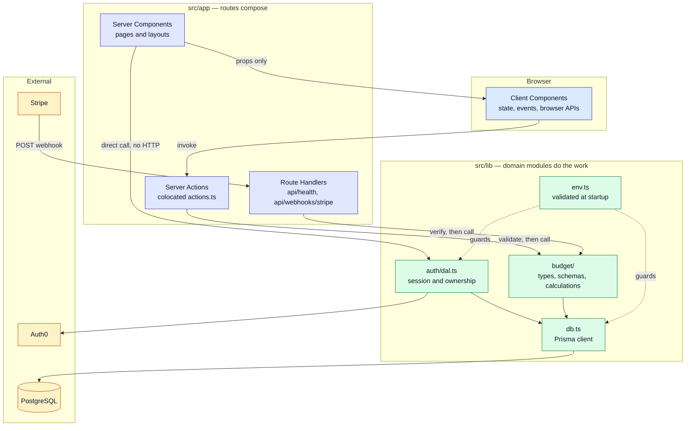
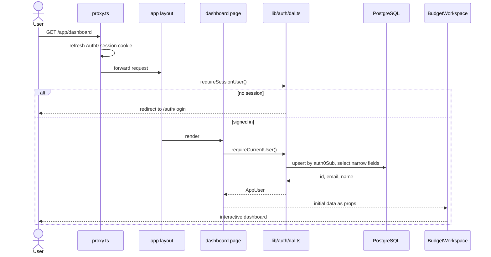

# BudgitUrself

BudgitUrself is a personal budgeting web app built on the idea that **manual budgeting beats
automated budgeting**. You get a clearer, more honest picture of your money when you are the one
entering and categorizing it — not a sync engine guessing at your categories.

The app answers one question most budgeting tools bury: *after everything I actually owe, how much
is genuinely left?*

---

## What it does

- **Paycheck tracking** — log your income and see it allocated across your budget.
- **Expense management** — track fixed expenses and see what's left to spend after they're covered.
- **Budget overview** — instantly see how much you're free to spend on extras once essentials are
  accounted for.
- **Categorization** — organize spending by card and by category to see exactly where your money
  goes.
- **The Horizon View** — the headline number: bank balance + income − current obligations − fixed
  expenses. Everything else on the dashboard feeds into it.

The financial model the dashboard implements is written up in
[docs/budget-model.md](docs/budget-model.md).

## Tech stack

| Concern | Choice |
| --- | --- |
| Framework | [Next.js](https://nextjs.org) 16 (App Router) + React 19 + TypeScript |
| Styling | Tailwind CSS v4, Radix UI primitives, shadcn-style components |
| Validation | [Zod](https://zod.dev) at every trust boundary |
| Database | [Prisma](https://www.prisma.io) on PostgreSQL ([Supabase](https://supabase.com)) |
| Auth | [Auth0](https://auth0.com) |
| Billing | Stripe (webhook endpoint scaffolded, not yet wired up) |
| Testing | [Vitest](https://vitest.dev) on the domain layer |
| Hosting | [Vercel](https://vercel.com) |

## Status

Actively in development. The marketing site is built out. The dashboard renders the full budget
model against placeholder data — persistence for budgets, accounts and transactions is the next
piece of work. Auth, the user record, and the schema/migration pipeline are live.

---

## Architecture

The project follows the App Router architecture described in
[Next.js App Router Architecture in 2026](https://www.pean.dev/blog/nextjs-app-router-architecture-in-2026).
One sentence carries the whole design:

> **Routes compose, domain modules do the work, and every boundary validates what enters it.**

### The layers



**A Server Component never fetches this app's own Route Handlers.** It calls a domain function
directly. Route Handlers exist only where there is a real HTTP contract — a webhook, a health probe,
a future mobile or partner endpoint.

### An authenticated request



The layout redirect is the **first** gate, never the only one. Every read re-establishes ownership
inside the DAL, because a layout is not a security boundary.

### Rules this codebase follows

| Rule | How it shows up here |
| --- | --- |
| Routes compose, domains do the work | `page.tsx` files read data and lay out sections; the math lives in `lib/budget/calculations.ts` |
| Colocate until reuse is real | Route-only UI lives in `app/<route>/components/`, route-only logic in `app/<route>/lib/`; only genuinely shared primitives sit in the top-level `components/ui/` |
| Group by product domain, not technical layer | `lib/budget/`, `lib/auth/` — no `services/`, `helpers/` or `utils/` grab-bags |
| Keep the client boundary low | Only `BudgetWorkspace` and the dialogs are `"use client"`; the header, page shell and marketing pages stay on the server |
| Validate at every boundary | Zod schemas parse dialog input; `lib/env.ts` validates environment variables at startup |
| Return narrower data than the database holds | The DAL selects `id, email, name` — never a whole row |
| Loading, error and empty states are product decisions | `loading.tsx`, `error.tsx`, `not-found.tsx`, plus explicit empty states in each list |
| Don't build layers ahead of complexity | No repository or service indirection, and no `queries.ts` / `mutations.ts` until budgets are actually persisted |

### Project structure

```
.
├── .github/workflows/ci.yml     format, lint, typecheck, test on every push
├── docs/budget-model.md         the financial model the dashboard implements
└── budgiturself/                the Next.js app
    ├── prisma/                  schema and migrations
    ├── auth0/                   hosted login page template
    └── src/
        ├── proxy.ts             Auth0 session refresh (Next.js middleware)
        ├── app/
        │   ├── layout.tsx       root layout, fonts, metadata
        │   ├── not-found.tsx
        │   ├── (marketing)/     public site
        │   │   ├── components/  hero, features, interactive-demo, categories, footer
        │   │   └── about, privacy, terms
        │   ├── (app)/           authenticated area
        │   │   ├── layout.tsx   session gate
        │   │   ├── error.tsx
        │   │   └── app/
        │   │       ├── dashboard/
        │   │       │   ├── page.tsx        server component
        │   │       │   ├── loading.tsx
        │   │       │   ├── components/     workspace, section cards, dialogs
        │   │       │   └── lib/            reducer hook, placeholder data
        │   │       └── accounts, budgets, transactions, settings
        │   └── api/
        │       ├── health, health/db       ops probes
        │       └── webhooks/stripe         real HTTP contract
        ├── components/ui/       shared primitives (button, card, dialog, …)
        └── lib/
            ├── auth/            auth0.ts client, dal.ts data-access layer
            ├── budget/          types.ts, schemas.ts, calculations.ts
            ├── db.ts            Prisma singleton
            ├── env.ts           validated environment
            ├── format.ts        currency and date formatting
            └── utils.ts         cn()
```

### Where does new code go?

| You are adding… | Put it in |
| --- | --- |
| UI used by exactly one route | `app/<route>/components/` |
| A hook or helper used by exactly one route | `app/<route>/lib/` |
| A primitive reused across routes | `components/ui/` |
| Business rules, calculations, validation | `lib/<domain>/` |
| A mutation triggered by this app's own UI | a Server Action in `actions.ts` beside the route |
| An endpoint for something outside this app | `app/api/…/route.ts` |
| Third-party SDK glue | `lib/integrations/<provider>.ts` |

---

## Getting started

Setup, scripts and environment variables are documented in
[budgiturself/README.md](budgiturself/README.md).

```bash
cd budgiturself
npm install
cp .env.example .env.local
npm run db:deploy
npm run dev
```

Before opening a pull request:

```bash
npm run verify
```

## License

See [LICENSE](LICENSE).
