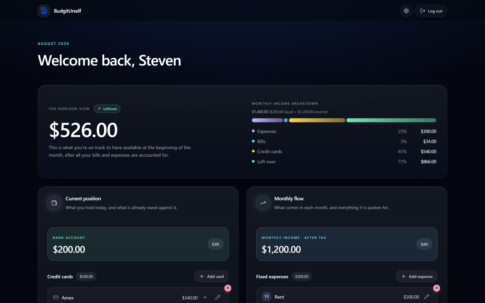
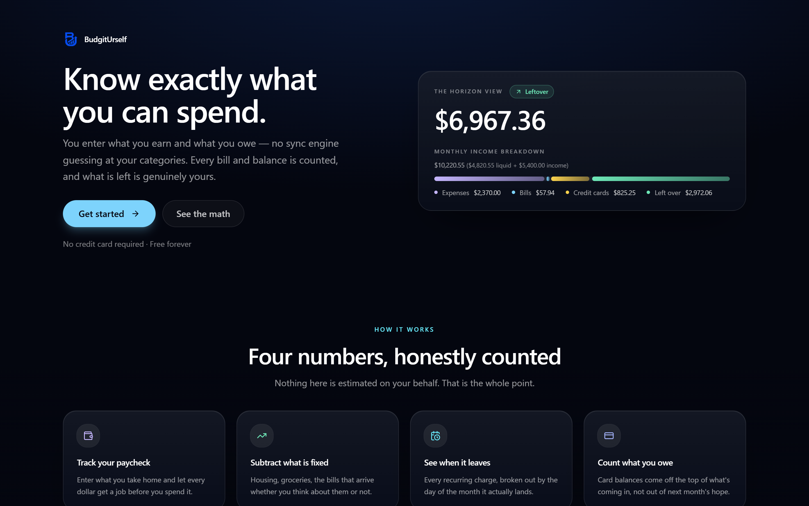
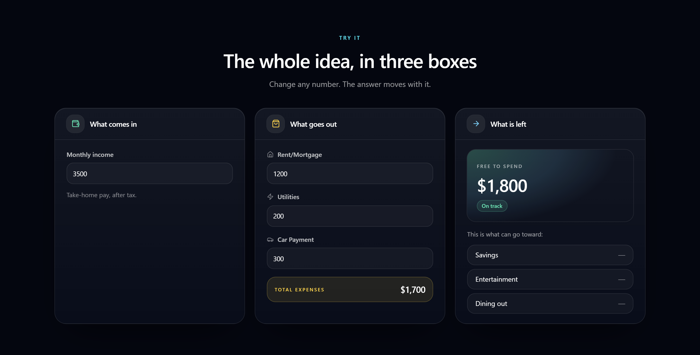
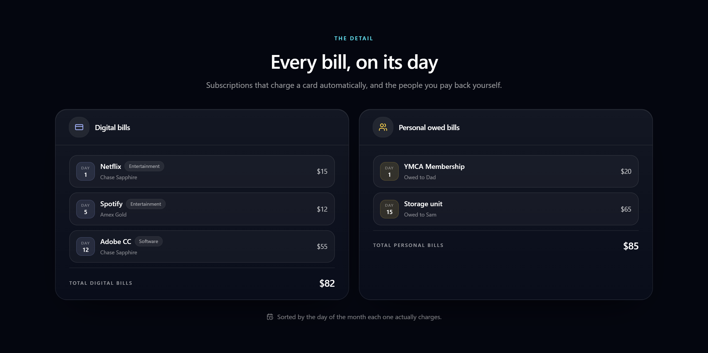
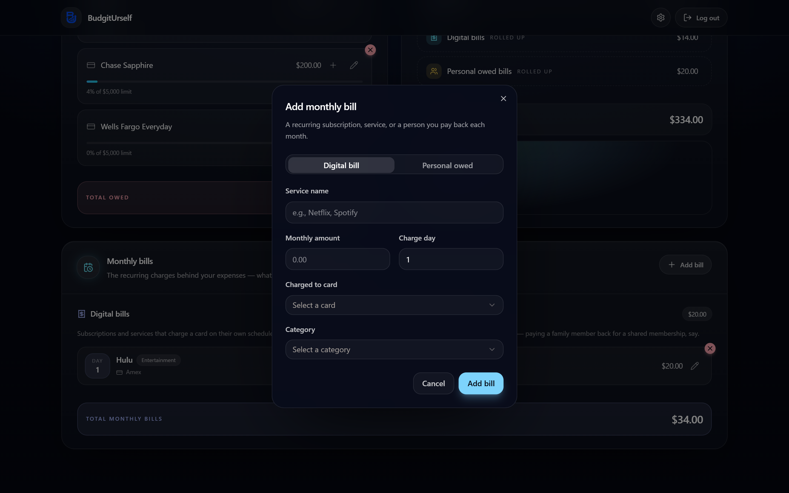
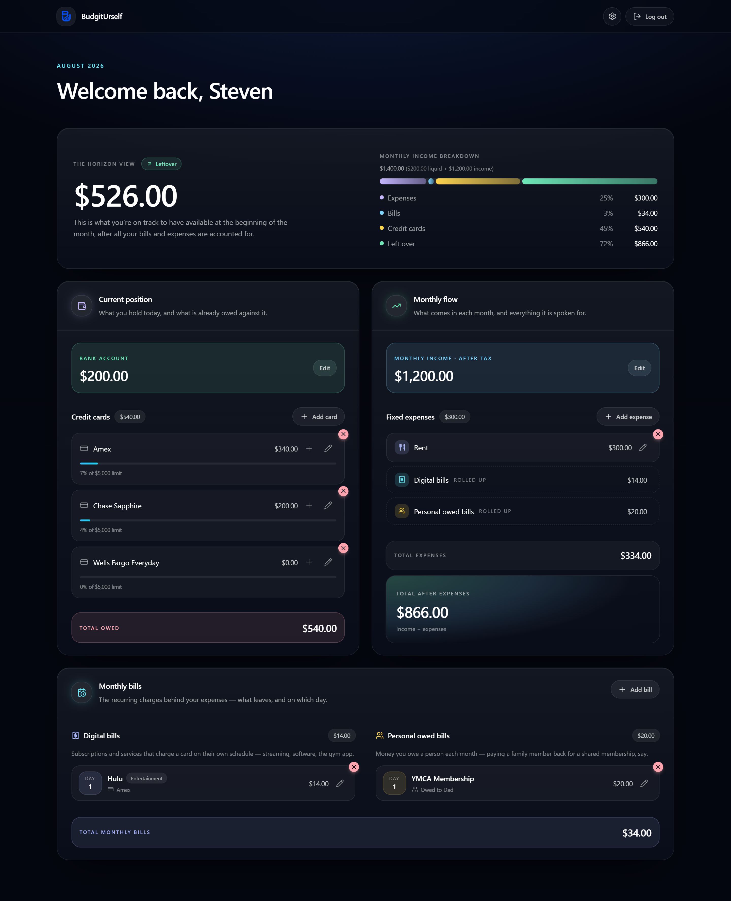
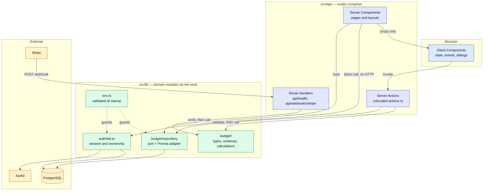
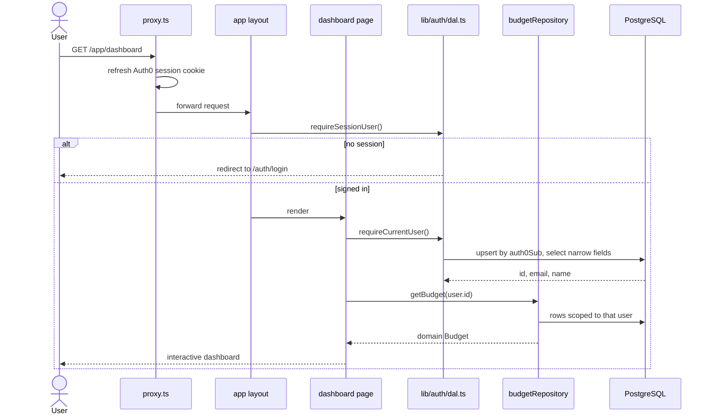

<div align="center">


# BudgitUrself

**Know exactly what you can spend.**

A manual-first budgeting app. You enter what you earn and what you owe — no sync engine guessing at
your categories — and the app answers the one question most budgeting tools bury:
*after everything I actually owe, how much is genuinely left?*

[](https://github.com/tylernpc/BudgitUrself/actions/workflows/ci.yml)


</div>

<div align="center">
  
</div>

---

## The idea

Automated budgeting tools import a transaction, guess a category, and hand you a number you did not
build and do not trust. BudgitUrself goes the other way: everything on the dashboard is something you
typed, so the headline figure is one you can actually defend.

That figure is **the Horizon View** — what you are on track to have at the start of next month once
every obligation is counted:

```
horizon view = bank balance + monthly income − credit card debt − fixed expenses
                                                                  └─ monthly expenses + monthly bills
```

Four numbers, honestly counted. Nothing is estimated on your behalf — that is the whole point. The
full model, in the words it was first written in, lives in [docs/budget-model.md](docs/budget-model.md);
it is the source of truth for anything that touches the math.

## What it does

- **The Horizon View** — the headline number, with a breakdown bar showing what each slice of your
  income is already spoken for.
- **Current position** — bank balance plus every credit card, with balance, limit and utilization.
- **Monthly flow** — take-home income against fixed expenses, and what survives the subtraction.
- **Monthly bills** — the recurring charges behind those expenses, split into *digital bills*
  (subscriptions that charge a card) and *personal owed bills* (the $20 a month you pay your dad),
  each sorted by the day of the month it actually lands.
- **Everything is editable in place** — cards, expenses and bills are added, edited and deleted from
  the dashboard itself, and every number above recalculates immediately.

## Screens

<table>
  <tr>
    <td width="50%">
      <br>
      <b>The pitch</b> — the landing page.
    </td>
    <td width="50%">
      <br>
      <b>Try it without an account</b> — change any number, the answer moves with it.
    </td>
  </tr>
  <tr>
    <td width="50%">
      <br>
      <b>Every bill, on its day</b> — digital and personal, sorted by charge date.
    </td>
    <td width="50%">
      <br>
      <b>Manual entry, validated</b> — a digital bill needs a card, a personal one needs a person.
    </td>
  </tr>
</table>

<details>
<summary><b>The whole dashboard, top to bottom</b></summary>

<div align="center">
  
</div>

</details>

## Tech stack

| Concern    | Choice                                                          |
| ---------- | --------------------------------------------------------------- |
| Framework  | [Next.js](https://nextjs.org) 16 (App Router) + React 19 + TypeScript |
| Styling    | Tailwind CSS v4, Radix UI primitives, shadcn-style components    |
| Validation | [Zod](https://zod.dev) at every trust boundary                   |
| Database   | [Prisma](https://www.prisma.io) on PostgreSQL ([Supabase](https://supabase.com)) |
| Auth       | [Auth0](https://auth0.com)                                       |
| Billing    | Stripe (webhook endpoint scaffolded, not yet wired up)           |
| Testing    | [Vitest](https://vitest.dev) on the domain layer                 |
| Hosting    | [Vercel](https://vercel.com)                                     |

## Status

Actively in development.

- **Live** — marketing site, Auth0 login, the dashboard end to end. Bank balance, income, credit
  cards, monthly expenses and bills are persisted to PostgreSQL through a Prisma-backed repository,
  edited through Server Actions, and every mutation is scoped to the signed-in user.
- **Scaffolded** — the Stripe webhook route (returns `501` until billing is wired up).
- **Not built yet** — the `accounts`, `budgets` and `transactions` routes are placeholders.

---

## Getting started

```bash
cd budgiturself
npm install
cp .env.example .env.local   # DATABASE_URL, DIRECT_URL, AUTH0_*, APP_BASE_URL
npm run db:deploy            # apply migrations
npm run dev
```

The app runs at `http://localhost:3000`. Auth0 needs `http://localhost:3000/auth/callback` as an
allowed callback URL and `http://localhost:3000` as an allowed logout URL. Scripts and environment
variables are documented in [budgiturself/README.md](budgiturself/README.md).

Before opening a pull request:

```bash
npm run verify   # format check, lint, typecheck, test — the same set CI runs
```

---

## Architecture

The project follows the App Router architecture described in
[Next.js App Router Architecture in 2026](https://www.pean.dev/blog/nextjs-app-router-architecture-in-2026).
One sentence carries the whole design:

> **Routes compose, domain modules do the work, and every boundary validates what enters it.**



**A Server Component never fetches this app's own Route Handlers.** It calls a domain function
directly. Route Handlers exist only where there is a real HTTP contract — a webhook, a health probe,
a future mobile or partner endpoint.

### The budget domain

`src/lib/budget/` is a small Clean Architecture split, so the math and the database never contaminate
each other:

| File                         | Role                                                                          |
| ---------------------------- | ----------------------------------------------------------------------------- |
| `types.ts`                   | Domain types — no Prisma type leaks past this layer                           |
| `schemas.ts`                 | A Zod schema per mutation, including the `billSchema` discriminated union      |
| `calculations.ts`            | The pure math from `docs/budget-model.md` — no I/O, fully unit tested          |
| `repository.ts`              | The `BudgetRepository` port, domain-typed in and out                           |
| `mappers.ts`                 | Explicit row ↔ domain conversion, including UTC-midnight date handling         |
| `prisma-budget-repository.ts`| The Prisma adapter; every mutation scoped by `{ id, userId }`                  |

Server Actions are the only callers, and they all have the same five-step shape: parse with the
schema → `requireCurrentUser()` → call the repository → `revalidatePath` → return.

<details>
<summary><b>An authenticated request, end to end</b></summary>



The layout redirect is the **first** gate, never the only one. Every read re-establishes ownership
inside the DAL, because a layout is not a security boundary.

</details>

<details>
<summary><b>Rules this codebase follows</b></summary>

| Rule                                             | How it shows up here                                                                                       |
| ------------------------------------------------ | ---------------------------------------------------------------------------------------------------------- |
| Routes compose, domains do the work              | `page.tsx` files read data and lay out sections; the math lives in `lib/budget/calculations.ts`             |
| Colocate until reuse is real                     | Route-only UI in `app/<route>/components/`, route-only logic in `app/<route>/lib/`; only shared primitives sit in `components/ui/` |
| Group by product domain, not technical layer     | `lib/budget/`, `lib/auth/` — no `services/`, `helpers/` or `utils/` grab-bags                              |
| Keep the client boundary low                     | Only `BudgetWorkspace` and the dialogs are `"use client"`; the header, page shell and marketing pages stay on the server |
| Validate at every boundary                       | Zod parses the dialog input *and* the Server Action input again server-side; `lib/env.ts` validates environment variables at startup |
| Return narrower data than the database holds     | The DAL selects `id, email, firstName, lastName` — never a whole row                                        |
| Ownership is re-established at the data layer    | Every repository mutation is scoped `{ id, userId }` via `updateMany` / `deleteMany`                        |
| Loading, error and empty states are product decisions | `loading.tsx`, `error.tsx`, `not-found.tsx`, plus explicit empty states in each list                    |

</details>

<details>
<summary><b>Project structure</b></summary>

```
.
├── .github/workflows/ci.yml     format, lint, typecheck, test on every push
├── docs/
│   ├── budget-model.md          the financial model the dashboard implements
│   └── screenshots/
└── budgiturself/                the Next.js app
    ├── prisma/                  schema and migrations
    ├── auth0/                   hosted login page template
    └── src/
        ├── proxy.ts             Auth0 session refresh (Next.js middleware)
        ├── app/
        │   ├── layout.tsx       root layout, fonts, metadata
        │   ├── not-found.tsx
        │   ├── (marketing)/     public site
        │   │   ├── components/  hero, features, interactive demo, bills preview, footer
        │   │   └── about, privacy, terms
        │   ├── (app)/           authenticated area
        │   │   ├── layout.tsx   session gate
        │   │   ├── error.tsx
        │   │   └── app/
        │   │       ├── dashboard/
        │   │       │   ├── page.tsx        server component
        │   │       │   ├── loading.tsx
        │   │       │   ├── components/     workspace, section cards, dialogs
        │   │       │   └── lib/            actions.ts, budget reducer
        │   │       └── accounts, budgets, transactions
        │   └── api/
        │       ├── health, health/db       ops probes
        │       └── webhooks/stripe         real HTTP contract
        ├── components/ui/       shared primitives (button, card, dialog, …)
        └── lib/
            ├── auth/            auth0.ts client, dal.ts data-access layer
            ├── budget/          types, schemas, calculations, repository, mappers
            ├── db.ts            Prisma singleton
            ├── env.ts           validated environment
            ├── format.ts        currency and date formatting
            └── utils.ts         cn()
```

</details>

<details>
<summary><b>Where does new code go?</b></summary>

| You are adding…                            | Put it in                                    |
| ------------------------------------------ | -------------------------------------------- |
| UI used by exactly one route               | `app/<route>/components/`                    |
| A hook or helper used by exactly one route | `app/<route>/lib/`                           |
| A primitive reused across routes           | `components/ui/`                             |
| Business rules, calculations, validation   | `lib/<domain>/`                              |
| A mutation triggered by this app's own UI  | a Server Action in `actions.ts` beside the route |
| An endpoint for something outside this app | `app/api/…/route.ts`                         |
| Third-party SDK glue                       | `lib/integrations/<provider>.ts`             |

</details>

## License

Proprietary — all rights reserved. See [LICENSE](LICENSE).
